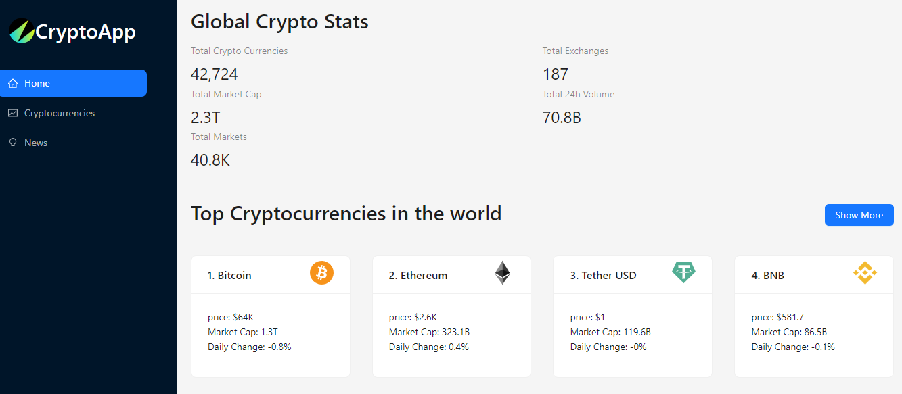
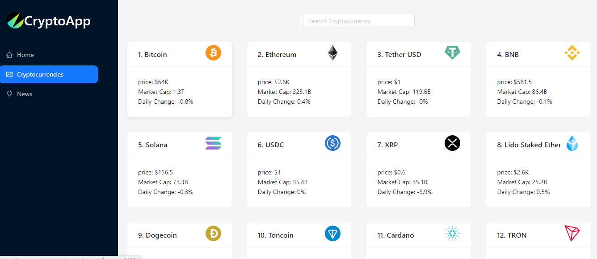
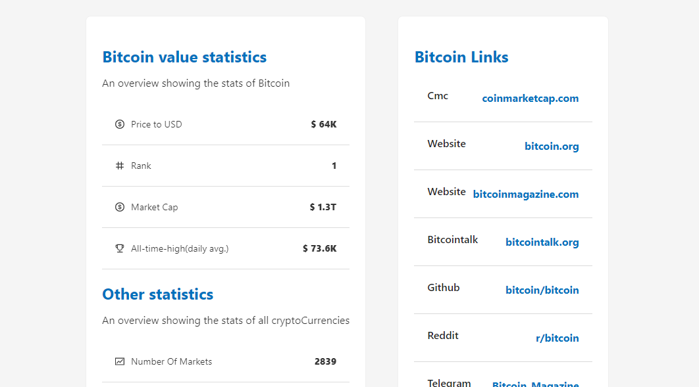
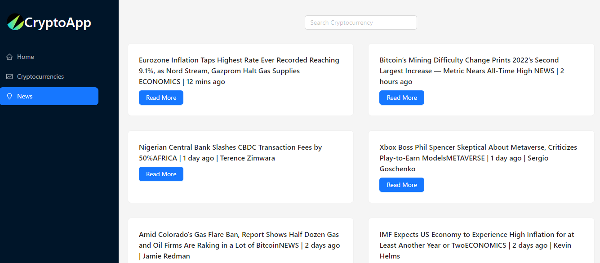

# CryptoApp

CryptoApp is a comprehensive cryptocurrency tracking and information platform built with React & Vite + Redux Toolkit. It provides users with real-time cryptocurrency data, detailed information on individual currencies, interactive charts, and the latest crypto news.

## Features

- **Live Currency Status**: Get up-to-date prices of cryptocurrencies in US dollars.
- **Detailed Currency Information**: Access in-depth details about individual cryptocurrencies.
- **Interactive Charts**: Visualize historical price data and trends.
- **Crypto News**: Stay informed with the latest news related to cryptocurrencies.
- **Responsive Design**: Enjoy a seamless experience across desktop and mobile devices.

## Technologies Used

- React
- Vite
- Redux Toolkit
- Bootstrap
- Ant Design
- CoinRanking API
- Crypto News API
- 

## Getting Started

To run this project locally:

1. Clone the repository:
   ```bash
   git clone https://github.com/yourusername/CryptoApp.git
   ```
2. Navigate to the project directory:
   ```bash
   cd CryptoApp
   ```
3. Install dependencies:
   ```bash
   npm install
   ```
4. Start the development server:
   ```bash
   npm run dev
   ```
5. Open your browser and visit `http://localhost:5173` (or the port Vite is running on).

## Project Structure

## Project Structure

The CryptoApp project is organized into several key components:

- **src/**
  - **components/**: Reusable UI components
    - `Navbar.jsx`: Navigation bar component
    - `CryptoList.jsx`: Displays the list of cryptocurrencies
    - `CryptoDetails.jsx`: Shows detailed information for a single cryptocurrency
    - `Chart.jsx`: Renders interactive price charts
    - `News.jsx`: Displays crypto-related news articles
  - **pages/**: Main page components
    - `Home.jsx`: Landing page with overview of top cryptocurrencies
    - `Cryptocurrencies.jsx`: Page listing all tracked cryptocurrencies
    - `CryptoInfo.jsx`: Detailed page for individual cryptocurrency
    - `News.jsx`: Page displaying crypto news articles
  - **services/**: API integration and data fetching
    - `cryptoApi.js`: Handles requests to cryptocurrency data API
    - `newsApi.js`: Manages requests to crypto news API
  - **store/**: Redux store configuration
    - `store.js`: Redux store setup
    - `cryptoSlice.js`: Redux slice for cryptocurrency data
    - `newsSlice.js`: Redux slice for news data
  - **utils/**: Utility functions and helpers
    - `formatCurrency.js`: Functions for formatting currency values
    - `dateUtils.js`: Date formatting and manipulation utilities
  - `App.jsx`: Main application component
  - `main.jsx`: Entry point of the application

- **public/**: Static assets like images and favicon

- **index.html**: HTML template file

This structure separates concerns, making the project modular and easier to maintain. Components handle the UI, services manage API interactions, and the Redux store centralizes state management across the application.

## Screenshots

1. Dashboard Overview


2. All Crypto Details Overview


3. Single Currency Detail Page


4. Interactive Charts


5. News Section


## Future Enhancements

- Add user authentication for personalized watchlists
- Implement real-time price alerts
- Integrate more data sources for comprehensive analysis

## Contributing

Contributions are welcome! Please feel free to submit a Pull Request.

## License

This project is licensed under the [MIT License](LICENSE).

## Acknowledgements

- Data provided by [Your API source]
- Icons from [Your icon source]
- [Any other acknowledgements]
